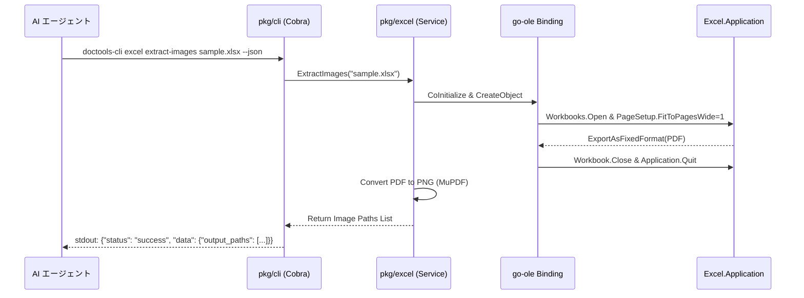
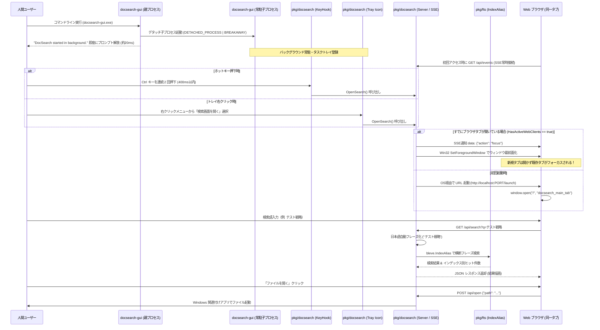
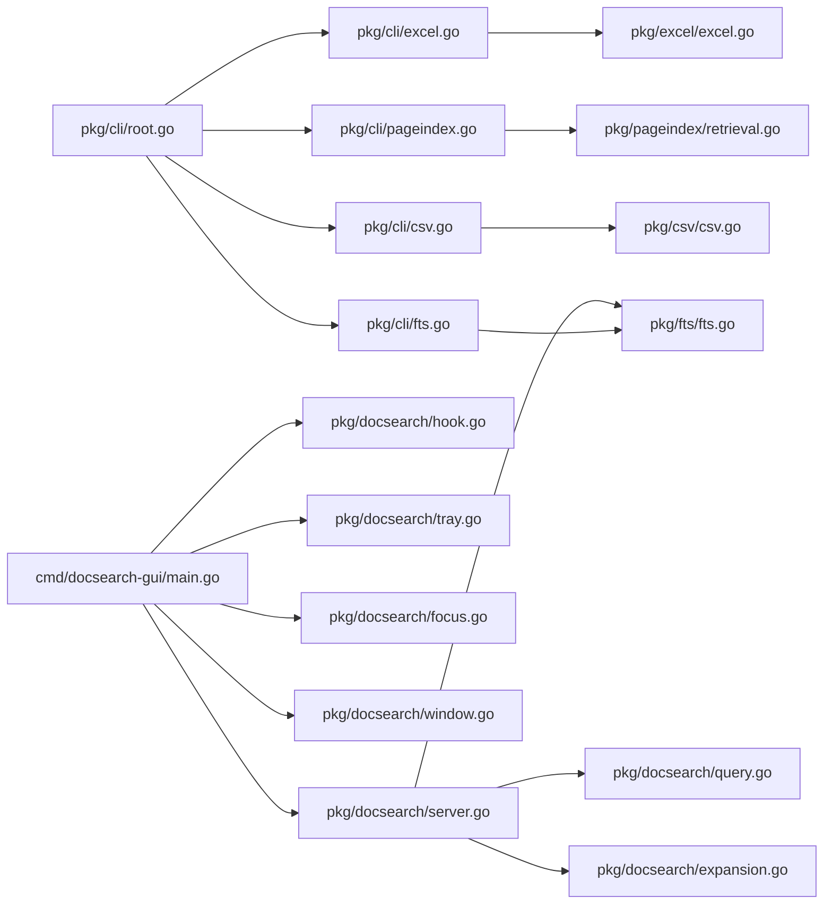

# Agent-Native CLI 設計書 (`doctools-cli`)

## 目次
- [機能一覧](#機能一覧)
- [機能詳細](#機能詳細)
- [アーキテクチャ](#アーキテクチャ)
    - [設計方針](#設計方針)
    - [全体構成図](#全体構成図)
    - [レイヤー構造](#レイヤー構造)
    - [全体シーケンス図](#全体シーケンス図)
    - [データフロー図](#データフロー図)
- [インターフェース](#インターフェース)
    - [CLI インターフェース (API/Tool相当)](#cli-インターフェース-apitool相当)
    - [データインターフェース](#データインターフェース)
- [コンポーネント](#コンポーネント)
    - [ハイレベル・コンポーネント図](#ハイレベルコンポーネント図)
    - [コンポーネント・パッケージ詳細 IPO テーブル](#コンポーネントパッケージ詳細-ipo-テーブル)
- [データモデル](#データモデル)
    - [Bleve FTS インデックス構造](#bleve-fts-インデックス構造)
    - [PageIndex JSON スキーマ](#pageindex-json-スキーマ)
    - [Excel パッチ JSON スキーマ & Go 構造体](#excel-パッチ-json-スキーマ--go-構造体-pkgexcel)
    - [DocSearch 設定ファイルスキーマ](#docsearch-設定ファイルスキーマ-docsearchjson)
    - [DocSearch マルチインデックス検索 REST レスポンス](#docsearch-マルチインデックス検索-rest-レスポンス-get-apisearch)
    - [DocSearch 検索履歴スキーマ](#docsearch-検索履歴スキーマ-historyjson)
    - [DocSearch インクリメンタルサジェスト REST レスポンス](#docsearch-インクリメンタルサジェスト-rest-レスポンス-get-apihistorysuggestprefix)
- [エラーハンドリング](#エラーハンドリング)

---

## 機能一覧

| 機能カテゴリ | 機能ID | 機能名 | 概要 | 対応要件ID |
|:---|:---|:---|:---|:---|
| 横断・基盤 | CLI-F01 | non-interactive | 対話プロンプト完全排除・`--force` による安全上書き制御 | NFR-01 |
| 横断・基盤 | CLI-F02 | structured-output | `--json` による構造化出力および `stderr` エラーハンドリング | NFR-02 |
| 探訪 | INTRO-F01 | agent-context | CLI の全サブコマンドと引数型定義を JSON 出力 | NFR-03 |
| 品質・検証 | QA-F01 | test-coverage | 主要パッケージにおけるカバレッジ 90% 以上の達成 | NFR-04 |
| Excel操作 | EXCEL-F01 | excel list-sheets | Excel 内の全シート名一覧を取得 | EXCEL-01 |
| Excel操作 | EXCEL-F02 | excel extract-csv | Excel シートを個別の CSV ファイルとして抽出 | EXCEL-02 |
| Excel操作 | EXCEL-F03 | excel extract-images | Excel シートを Fit-to-Page 設定で高精度 PNG 化 (`go-ole`) | EXCEL-03 |
| Excel操作 | EXCEL-F05 | excel diff | Excel ファイル間のセル単位差分比較 (値, 数式, 結合範囲 `merged_range`) | EXCEL-05 |
| Excel操作 | EXCEL-F06 | excel patch | 自動バックアップ・BOMトリム・配列パッチ・`old_value`ガードレール付き安全パッチ適用 | EXCEL-06 |
| Excel操作 | EXCEL-F07 | excel extract-markdown | Excel シートの Markdown 抽出 (オプション `--with-coords` でセル座標付与) | EXCEL-07 |
| Excel操作 | EXCEL-F08 | excel search-cell | キーワードによるセル検索およびセル番地・結合情報取得 | EXCEL-08 |
| Excel操作 | EXCEL-F09 | excel extract-text | excel extract-markdown への統一エイリアス | EXCEL-09 |
| PowerPoint操作 | PPTX-F01 | pptx extract-text | PPTX スライドのテキストを Markdown として抽出 | PPTX-01 |
| PowerPoint操作 | PPTX-F02 | pptx merge | 複数の PPTX ファイルを 1 つにマージ | PPTX-02 |
| PowerPoint操作 | PPTX-F03 | pptx extract-images | PPTX スライドを指定解像度で PNG 化 (`go-ole`) | PPTX-03 |
| PDF操作 | PDF-F01 | pdf extract-text | PDF テキストを Markdown として抽出 (`pdfcpu`) | PDF-01 |
| PDF操作 | PDF-F02 | pdf split / pdf merge | PDF の特定ページ切り出し、および複数 PDF 結合 | PDF-02 |
| PDF操作 | PDF-F03 | pdf extract-images | PDF 埋め込み画像オブジェクトの抽出 (`pdfcpu`) | PDF-03 |
| PDF操作 | PDF-F04 | pdf extract-pages | PDF ページ全画面ラスタライズ画像化 (`go-fitz` / MuPDF CGO) | PDF-04 |
| 全文検索 (FTS) | FTS-F01 | fts build | Bleve エンジンによる並列 N-gram 全文検索インデックス構築 | FTS-01 |
| 全文検索 (FTS) | FTS-F02 | fts query | キーワードおよびブール条件による全文検索 (AI ナビゲーション付与) | FTS-02 |
| 全文検索 (FTS) | FTS-F03 | fts build --file-timeout | タイムアウト制御による安全なファイルスキップ | FTS-03 |
| 全文検索 (FTS) | FTS-F04 | fts build --include-ext | 対象拡張子の包含・除外フィルター | FTS-04 |
| 全文検索 (FTS) | FTS-F05 | fts query (Self-Describing) | AI エージェント向けクエリ構文・フィールド定義の自己説明 | FTS-05 |
| 全文検索 (FTS) | FTS-F06 | fts build (--include-dir / --exclude-dir) | 隠しディレクトリのデフォルト除外 & ディレクトリ包含/除外フィルター | FTS-06 |
| 構造RAG | PI-F01 | pageindex build | LLM サマリー付き構造 PageIndex インデックスの生成 | PAGEINDEX-01 |
| 構造RAG | PI-F02 | pageindex tree | 目次・ツリー構造の段階的取得 | PAGEINDEX-02 |
| 構造RAG | PI-F03 | pageindex content | 特定ノード / ページ / シートのフルテキストピンポイント抽出 | PAGEINDEX-03 |
| CSV操作 | CSV-F01 | csv read-cells | 指定した行・列範囲のセル値を JSON 配列取得 | CSV-01 |
| CSV操作 | CSV-F02 | csv search | CSV 内の文字列検索とセル位置取得 | CSV-02 |
| CSV操作 | CSV-F03 | csv metadata | CSV のエンコーディング・行数・列数取得 | CSV-03 |
| CSV操作 | CSV-F04 | csv extract | CSV の指定範囲を別 CSV へ切り出し抽出 | CSV-04 |
| テキスト操作 | TEXT-F01 | text head / text tail | テキストファイルの先頭 / 末尾行取得 | TEXT-01 |
| テキスト操作 | TEXT-F02 | text grep | 正規表現によるテキストファイル内検索 | TEXT-02 |
| テキスト操作 | TEXT-F03 | text metadata / text convert | 文字コード判定および相互変換 | TEXT-03 |
| テキスト操作 | TEXT-F04 | text copy-clipboard | クリップボードへのテキスト設定 (Windows) | TEXT-04 |
| HTML操作 | HTML-F01 | html extract-text | HTML ファイルから Markdown テキスト抽出 | HTML-01 |
| 画像操作 | IMAGE-F01 | image metadata | 画像の解像度（幅・高さ）等のメタデータ取得 | IMAGE-01 |
| 画像操作 | IMAGE-F02 | image crop | 画像の指定領域切り抜き (Crop) | IMAGE-02 |
| 画像操作 | IMAGE-F03 | image save-clipboard | クリップボード画像の PNG 保存 (Windows) | IMAGE-03 |
| 共通ユーティリティ | UTIL-F01 | util zip / util unzip | 複数ファイルの ZIP 圧縮、および解凍 | UTIL-01 |
| デスクトップ検索GUI | DOCSEARCH-F01 | docsearch hotkey-launcher | Win32 低レベルフックによる Ctrl 連打検知と同一タブ検索画面直接起動 | DOCSEARCH-01 |
| デスクトップ検索GUI | DOCSEARCH-F02 | docsearch tray-resident | タスクトレイ（通知領域）常駐およびコンテキストメニュー提供 | DOCSEARCH-02 |
| デスクトップ検索GUI | DOCSEARCH-F03 | docsearch web-ui | ブラウザ上での Bleve IndexAlias 横断検索結果表示・日本語自動フレーズ処理 | DOCSEARCH-03 |
| デスクトップ検索GUI | DOCSEARCH-F04 | docsearch open-doc | 検索結果からのファイル・フォルダ直接起動 | DOCSEARCH-04 |
| デスクトップ検索GUI | DOCSEARCH-F05 | docsearch query-expansion | Google GenAI SDK による表記揺れ・同義語の展開とタグ選択 | DOCSEARCH-05 |
| デスクトップ検索GUI | DOCSEARCH-F06 | docsearch query-history | 検索履歴の永続化保持およびインクリメンタルサジェスト補完 | DOCSEARCH-06 |
| デスクトップ検索GUI | DOCSEARCH-F07 | docsearch index-management | 起動時インデックス実在ヘルスチェックおよび動的インデックス管理 | DOCSEARCH-07 |
| デスクトップ検索GUI | DOCSEARCH-F08 | docsearch same-tab-controller | SSE & ウィンドウ最前面化連携によるブラウザ同一タブ制御（タブ乱立防止） | DOCSEARCH-08 |
| デスクトップ検索GUI | DOCSEARCH-F09 | docsearch background-spawn | コマンドラインからのバックグラウンド自己デタッチ起動 & Job Object Breakaway | DOCSEARCH-09 |


---

## 機能詳細

### 機能カテゴリ: 探訪 (INTRO)
- **INTRO-F01: agent-context**
  - **概要**: CLI の全サブコマンド、引数型、フラグの構造化 JSON スキーマを出力する。
  - **対応要件**: NFR-03
  - **設計のポイント**: Cobra コマンドツリーを動的走査して JSON スキーマを自動生成する。

### 機能カテゴリ: Excel操作 (EXCEL)
- **EXCEL-F01: excel list-sheets**
  - **概要**: Excel ファイルの全シート名を取得する。
  - **対応要件**: EXCEL-01
  - **設計のポイント**: `excelize` を用い、メモリ消費を抑えてシート名一覧を取得。
- **EXCEL-F02: excel extract-csv**
  - **概要**: Excel シートを個別 CSV として書き出す。
  - **対応要件**: EXCEL-02
  - **設計のポイント**: `excelize` で高速抽出。デフォルトエンコーディングは UTF-8。
- **EXCEL-F03: excel extract-images**
  - **概要**: `go-ole` 経由で `PageSetup.FitToPagesWide = 1` を設定し、PDF 経由で高品質 PNG 化。
  - **対応要件**: EXCEL-03
  - **設計のポイント**: COM オブジェクト破棄とゾンビプロセス防止の徹底。
- **EXCEL-F05: excel diff**
  - **Input**: 比較元 `.xlsx` パス (`file_a`), 比較対象 `.xlsx` パス (`file_b`), `--sheets` (`-s`), `--json`
  - **Processing**: 2つの Excel を `excelize` で開き、共通シートの各セル値・数式・結合範囲 (`merged_range`) を比較。結合セルは代表セル（左上）のみ比較して `MergedRange` 情報を付与。
  - **Output**: 差分要素リスト (`file_a`, `file_b`, `total_changes`, `differences` 配列) を JSON またはテキスト出力。
  - **対応要件**: EXCEL-05
- **EXCEL-F06: excel patch**
  - **Input**: 対象 `.xlsx` パス, `--patch-file` (`-p`), `--backup` (`-b`), `--dry-run`, `--schema`, `--json`
  - **Processing**:
    1. `--schema` フラグ指定時: サンプルパッチ JSON テンプレートを出力して終了。
    2. BOM トリム & JSON アンマーシャル: `bytes.TrimPrefix(data, []byte("\xef\xbb\xbf"))` を実行後、整形式 JSON 配列 `[]ExcelPatchItem` として直感的にパース。失敗時は具体的なヒント付きエラーを出力。
    3. ガードレール検証:
       - `OldValue` (または `ExpectedOldValue`) が指定されている場合、現在のセル値と厳格比較（不一致時エラーアボート）。
       - `null` (または空ポインタ指定) の場合: `Guardrail bypassed` ログを記録し無条件上書き。
       - キー省略時: 警告 `Guardrail omitted` ログを記録し上書き。
    4. パッチ適用 & 監査ログ出力: `dryRun == false` 時ディスク保存。
  - **Output**: 監査ログ (`target_file`, `backup_file`, `dry_run`, `applied_count`, `audit_log`) を JSON 出力。
  - **対応要件**: EXCEL-06
- **EXCEL-F07: excel extract-markdown**
  - **Input**: 対象 `.xlsx` パス, `--sheets` (`-s`), `--with-coords`, `--output` (`-o`), `--json`
  - **Processing**: 指定シートのセル内容を Markdown テーブル形式で抽出。`--with-coords` フラグ指定時は各セル値の先頭にセル座標プレフィックス（例: `[C5]`）を付与。
  - **Output**: 生成された Markdown パスまたは Markdown テキスト。
  - **対応要件**: EXCEL-07
- **EXCEL-F08: excel search-cell**
  - **Input**: 対象 `.xlsx` パス, 検索クエリ, `--sheets` (`-s`), `--json`
  - **Processing**: 指定シートの全セル内容を部分一致/正規表現で検索。一致セルの番地、値、シート名、結合範囲情報を抽出。
  - **Output**: 一致結果リスト (`total_matches`, `matches` 配列) を JSON 出力。
  - **対応要件**: EXCEL-08
- **EXCEL-F09: excel extract-text**
  - **概要**: `excel extract-markdown` への統一エイリアス。
  - **対応要件**: EXCEL-09

### 機能カテゴリ: PowerPoint操作 (PPTX)
- **PPTX-F01: pptx extract-text**
  - **概要**: PPTX スライドテキストを Markdown ファイルに抽出保存。
  - **対応要件**: PPTX-01
  - **設計のポイント**: 純 Go (zip+xml) でスライドツリーを走査。
- **PPTX-F02: pptx merge**
  - **概要**: 複数の PPTX ファイルを1つにマージ保存。
  - **対応要件**: PPTX-02
  - **設計のポイント**: 純 Go で SlideMaster / XML 構造を保持して結合。
- **PPTX-F03: pptx extract-images**
  - **概要**: 指定スライドを高精度 PNG 画像として書き出し。
  - **対応要件**: PPTX-03
  - **設計のポイント**: `go-ole` 経由で `PowerPoint.Application` の `slide.Export` を呼び出し。

### 機能カテゴリ: PDF操作 (PDF)
- **PDF-F01: pdf extract-text**
  - **概要**: PDF テキストを高精度に抽出し、Markdown/テキストファイルへ保存。
  - **対応要件**: PDF-01
  - **設計のポイント**: `go-fitz` (MuPDF) を用い、ToUnicode CMap を完全解決して日本語・縦書きを高品質抽出。一時ファイル不要のインメモリ処理により高速化し、描画命令オペレータの混入を完全防止。
- **PDF-F02: pdf split / merge**
  - **概要**: PDF ページ範囲切り出しおよび複数 PDF 結合。
  - **対応要件**: PDF-02
  - **設計のポイント**: `pdfcpu` により高速なバイナリ結合・分割処理。
- **PDF-F03: pdf extract-images**
  - **概要**: PDF 内部に埋め込まれた画像オブジェクト (JPEG/PNG) を抽出し保存。
  - **対応要件**: PDF-03
  - **設計のポイント**: `pdfcpu` により埋め込み画像オブジェクトを無劣化で一括抽出。
- **PDF-F04: pdf extract-pages**
  - **概要**: PDF 各ページを全画面ラスタライズレンダリングし、指定 DPI および画像フォーマットで一括出力。
  - **対応要件**: PDF-04
  - **設計のポイント**: `go-fitz` (MuPDF CGO) バインディングにより、高速かつ高精細にページ描画を行い画像ファイルとして保存。

### 機能カテゴリ: 全文検索 (FTS)
- **FTS-F01: fts build**
  - **概要**: 指定フォルダの全文書 (Excel, PPT, PDF, CSV, Text) を On-the-fly で Markdown/CSV テキストへ変換・チャンク化し、差分チェックを行いメタデータ付き Bleve インデックスを構築。
  - **対応要件**: FTS-01
  - **設計のポイント**: 各形式パーサーによる On-the-fly テキスト化（PDF 解析には `go-fitz` を用いて各ページの UTF-8 テキストをインメモリ直接抽出）、`mtime` 比較による未変更ファイルの高速スキップ、Goroutine 並列処理、N-gram 解析、メタデータ (`file_path`, `unit_type`, `locator` 等) の保存。
- **FTS-F02: fts query**
  - **概要**: キーワードおよびブール演算子による全文検索を行い、コンテキスト前後スニペットとAI向けナビゲーション情報を返却。
  - **対応要件**: FTS-02
  - **設計のポイント**: Bleve ハイライター/フラグメンターによる前後テキスト抽出、`source` (共通ファイル情報) および `target` (形式別位置情報) を持つ JSON レスポンス構造。
- **FTS-F03: fts build --file-timeout**
  - **概要**: 重いファイルや破損ファイルのパース処理を `context.WithTimeout` で安全にスキップ。
  - **対応要件**: FTS-03
- **FTS-F04: fts build --include-ext / --exclude-ext**
  - **概要**: デフォルトで Office/PDF バイナリのみを対象とし、`--include-ext` / `--exclude-ext` で柔軟に拡張子を指定。
  - **対応要件**: FTS-04
- **FTS-F05: fts query (AIエージェント向け Self-Describing 強化)**
  - **概要**: `fts query` コマンドの Command `Long` 説明文に Bleve QueryString の構文ルール、具体例、および検索可能フィールド一覧を明記。
  - **対応要件**: FTS-05
- **FTS-F06: fts build (--include-dir / --exclude-dir)**
  - **概要**: 隠しディレクトリ（`.` 始まり）の自動スキップ、および `--exclude-dir` / `--include-dir` によるディレクトリ単位の高速走査枝刈り。
  - **対応要件**: FTS-06
  - **設計のポイント**:
    1. `filepath.Walk` 走査時にディレクトリを判定し、`filepath.SkipDir` を返却することで配下の探索を即座に中断・枝刈り。
    2. デフォルトでドット `.` で始まるディレクトリ（ルート自身を除く）をスキップ。
    3. `--exclude-dir` に指定されたディレクトリは即座にスキップ。
    4. `--include-dir` が指定された場合は指定ディレクトリ配下のみを許可。隠しディレクトリであっても `--include-dir` に明示指定されている場合は走査を許可。

### 機能カテゴリ: 構造RAG (PAGEINDEX)
- **PAGEINDEX-F01: pageindex build**
  - **概要**: `google.golang.org/genai` を用い、ドキュメントの階層構造サマリーを生成。
  - **対応要件**: PAGEINDEX-01
- **PAGEINDEX-F02: pageindex tree**
  - **概要**: ドキュメントの目次・階層構造ツリーの段階的取得。
  - **対応要件**: PAGEINDEX-02
- **PAGEINDEX-F03: pageindex content**
  - **概要**: 特定ノード ID の全文コンテンツのピンポイント抽出。
  - **対応要件**: PAGEINDEX-03

### 機能カテゴリ: CSV操作 (CSV)
- **CSV-F01: csv read-cells / CSV-F02: csv search / CSV-F03: csv metadata / CSV-F04: csv extract**
  - **概要**: CSV セル抽出・値検索・自動エンコーディング判定 (`chardet`)・別ファイル保存。
  - **対応要件**: CSV-01, CSV-02, CSV-03, CSV-04

### 機能カテゴリ: テキスト操作 (TEXT)
- **TEXT-F01: text head/tail / TEXT-F02: text grep / TEXT-F03: text metadata/convert / TEXT-F04: text copy-clipboard**
  - **概要**: 先頭・末尾行表示、正規表現 Grep 検索、エンコーディング判定 (`chardet`) 変換、Windows クリップボード設定。
  - **対応要件**: TEXT-01, TEXT-02, TEXT-03, TEXT-04

### 機能カテゴリ: HTML / IMAGE / UTIL
- **HTML-F01: html extract-text / IMAGE-F01: image metadata / IMAGE-F02: image crop / IMAGE-F03: image save-clipboard / UTIL-F01: util zip/unzip**
  - **概要**: HTML テキスト抽出、画像メタデータ・切り抜き・クリップボード保存、ZIP 圧縮・解凍。
  - **対応要件**: HTML-01, IMAGE-01〜03, UTIL-01

### 機能カテゴリ: デスクトップ全文検索GUI (DOCSEARCH)
- **DOCSEARCH-F01: docsearch hotkey-launcher**
  - **概要**: Win32 低レベルフック (`WH_KEYBOARD_LL`) により、グローバルな Ctrl キーのダブルタップ (400ms以内) を検知して、デフォルトブラウザで同一タブをターゲットとして検索画面を直接起動する。
  - **対応要件**: DOCSEARCH-01, DOCSEARCH-08
  - **設計のポイント**: バックグラウンド goroutine で Win32 メッセージループを回し、OS 全体のキー入力を低負荷で監視。小窓を介さず直接ブラウザを同一タブ（`docsearch_main_tab`）で開く。
- **DOCSEARCH-F02: docsearch tray-resident**
  - **概要**: タスクトレイ（通知領域）にアイコンを表示してバックグラウンド常駐し、右クリックメニュー（検索画面を開く、設定、終了）を提供する。
  - **対応要件**: DOCSEARCH-02
  - **設計のポイント**: 純 Go + `golang.org/x/sys/windows` による `Shell_NotifyIconW`（`NIM_ADD`, `NIM_DELETE`）および `CreatePopupMenu` / `TrackPopupMenu`。常駐中のプロセスを安全に制御し、タスクバーを占有しない。
- **DOCSEARCH-F03: docsearch web-ui & auto-phrase-query**
  - **概要**: 内蔵 Web サーバー（Go `net/http`）により、ブラウザ上にリッチな検索画面を提供し、日本語検索クエリの自動フレーズ化（`"..."` でクォート）と Bleve IndexAlias による横断検索を行う。
  - **対応要件**: DOCSEARCH-03
  - **設計のポイント**: ユーザーが「テスト戦略」と入力した場合、文字種境界で勝手に OR 分割されないよう内部的に `"テスト戦略"` に変換して完全一致検索を実行。各インデックス別のヒット件数バッジとスニペットハイライトを表示。
- **DOCSEARCH-F04: docsearch open-doc**
  - **概要**: 検索結果から対象ドキュメントまたは親フォルダを直接開く。
  - **対応要件**: DOCSEARCH-04
  - **設計のポイント**: ローカル Web サーバーの `/api/open` エンドポイント経由で `rundll32 url.dll,FileProtocolHandler` または `explorer.exe /select,path` を安全に実行。
- **DOCSEARCH-F05: docsearch query-expansion**
  - **概要**: Google GenAI SDK（Gemini Flash）を用いて検索クエリの同義語・関連語・表記揺れを生成し、検索結果画面にタグとして提示する。
  - **対応要件**: DOCSEARCH-05
  - **設計のポイント**: ユーザーがクリックしたタグを動的に OR 検索条件に加えて再検索を実行。
- **DOCSEARCH-F06: docsearch query-history**
  - **概要**: 実行された検索キーワードをローカルファイル（`history.json`）に永続化し、WebUI 入力時に入力文字列と前方一致・部分一致する候補をリアルタイムにサジェスト表示する。
  - **対応要件**: DOCSEARCH-06
  - **設計のポイント**: 検索実行時に `AddHistory(query)` で利用頻度 (`use_count`) と最終利用日時 (`last_used_at`) を更新。インクリメンタルサジェスト時は頻度順・日時順でソートした上位10件を返却。上下キー操作で入力補完可能。
- **DOCSEARCH-F07: docsearch index-management**
  - **概要**: インデックスの追加・削除・選択状態管理および実在性ヘルスチェックを設定画面（WebUI `/settings` またはモーダル）で行う。
  - **対応要件**: DOCSEARCH-07
  - **設計のポイント**: 登録済みインデックスのパスを `os.Stat` で走査し、存在しないものは警告（選択不可）表示。フォルダ選択ダイアログまたはWeb画面からのパス入力で `.bleve` インデックスを追加・削除し、`docsearch.json` に即時反映。
- **DOCSEARCH-F08: docsearch same-tab-controller**
  - **概要**: ブラウザ起動時に新規タブが無限に増えるのを防ぎ、同一タブ（名前付きウィンドウ/タブ）を再利用して検索画面を開く。
  - **対応要件**: DOCSEARCH-08
  - **設計のポイント**: `/launch` エンドポイントでターゲット名（`docsearch_main_tab`）を指定した `window.open` を実行し、既存タブがあればフォーカス・リロードして自身を閉じる。または既存タブ接続時のアクティブ化。
- **DOCSEARCH-F09: docsearch background-spawn**
  - **概要**: コマンドラインから起動された際、デフォルトで自身をバックグラウンド（デタッチ）プロセスとして起動し、コマンドラインプロンプトを即座に解放する。
  - **対応要件**: DOCSEARCH-09
  - **設計のポイント**: `--foreground` (`-f`) フラグ未指定時に `os.Executable()` で自身の子プロセスを `windows.CREATE_NEW_PROCESS_GROUP | windows.DETACHED_PROCESS` フラグ付きで起動し、親プロセスは即座に終了（`os.Exit(0)`）。デバッグ時のみ `--foreground` を指定してコンソール出力を維持。

---

## アーキテクチャ

### 設計方針
1. **Agent-Native CLI 原則の徹底**: 非対話型・JSON構造化出力 (`stdout`/`stderr` 完全分離)・3-Layer Introspection (Layer 1: `--help`, Layer 2: `agent-context`, Layer 3: `SKILL.md`)。
2. **Multi-Binary によるエージェント純度維持**: AI エージェント用 CLI (`doctools-cli.exe`) と人間向け検索 GUI (`docsearch-gui.exe`) を独立バイナリとして分離し、Introspection の混乱を防止。
3. **シングルバイナリ化 (Single Binary)**: CGO 静的リンクによる MuPDF / Bleve / `go-ole`、および WebUI アセット（`embed`）の内蔵。
4. **ドメインの明確分離**: ドキュメント操作 / 全文検索 (`fts`) / 構造 RAG (`pageindex`) / デスクトップGUI (`docsearch`) の分離。


### 全体構成図

```mermaid
graph TD
    Agent["AI Agent / LLM"] -->|CLI Flag & JSON| CLI["CLI Entrypoint: doctools-cli"]
    Human["人間ユーザー"] -->|Ctrl連打 / Hotkey| GUI["GUI Entrypoint: docsearch-gui"]
    
    subgraph SingleBinary["Single Binary 1: doctools-cli.exe"]
        CLI --> ExcelSvc["pkg/excel"]
        CLI --> PPTXSvc["pkg/pptx"]
        CLI --> PDFSvc["pkg/pdf"]
        CLI --> FTSSvc["pkg/fts"]
        CLI --> PISvc["pkg/pageindex"]
        CLI --> CSVSvc["pkg/csv"]
        CLI --> TextSvc["pkg/text"]
        CLI --> UtilSvc["pkg/util"]
        
        ExcelSvc --> Excelize["excelize Engine"]
        PDFSvc --> PDFCpu["pdfcpu Engine"]
        PDFSvc --> MuPDF["MuPDF CGO Static Lib"]
        PISvc --> GenAI["google.golang.org/genai"]
        CSVSvc & TextSvc --> Chardet["saintfish/chardet"]
    end

    subgraph SingleBinary2["Single Binary 2: docsearch-gui.exe"]
        GUI --> Hook["pkg/docsearch (Win32 Hook)"]
        GUI --> Window["pkg/docsearch (Native Window)"]
        GUI --> WebServer["pkg/docsearch (Web Server)"]
        GUI --> Expansion["pkg/docsearch (Query Expansion)"]
        
        Expansion --> GenAI
        WebServer --> FTSSvcShared["pkg/fts (Bleve Index Reader)"]
    end

    FTSSvc --> Bleve["Bleve Search Engine"]
    FTSSvcShared --> Bleve
    
    subgraph WindowsSystem["Windows System"]
        ExcelSvc -->|go-ole| ExcelApp["Excel.Application"]
        PPTXSvc -->|go-ole| PPTApp["PowerPoint.Application"]
        TextSvc & UtilSvc -->|go-ole| WinClip["Windows Clipboard"]
        Hook -->|WH_KEYBOARD_LL| WinOS["Windows OS Keyboard Event"]
        WebServer -->|Launch URL| Browser["Default Web Browser"]
        WebServer -->|ShellExecute| WinDoc["Associated App / Explorer"]
    end
```



### レイヤー構造
- **Presentation Layer**:
  - `pkg/cli`: フラグ入力解析、TTY 判定、3-Layer Introspection, JSON 構造化レスポンス成形。
  - `pkg/docsearch` (Window & Web): Win32 ネイティブ検索小窓、組み込み WebUI (HTML/CSS/JS)。
- **Service Layer (`pkg/excel`, `pkg/pdf`, `pkg/fts`, `pkg/pageindex`, `pkg/docsearch` 等)**: 各ドメインのビジネスロジック、ファイル処理、マルチインデックス検索、クエリ拡張。
- **Infrastructure / Native Layer**: `go-ole` COM バインディング、MuPDF CGO 静的バインディング、Win32 API (`golang.org/x/sys/windows`)、`saintfish/chardet` エンコーディング判定、Bleve ストレージ。

### 全体シーケンス図

#### 1. AI エージェントによる CLI 実行 (doctools-cli)


#### 2. 人間ユーザーによるデスクトップ全文検索 (docsearch-gui)


### データフロー図


---

## インターフェース

### CLI インターフェース (全 36 コマンド IPO)

全サブコマンドは標準で `--json` フラグ（構造化 JSON 出力）および `--force` フラグ（非対話的実行）をサポートします。

1. **`doctools-cli agent-context`**
   - Input: `--json` (bool)
   - Processing: Cobra コマンドツリー走査による JSON スキーマ生成
   - Output: 全コマンド構文・パラメータ定義の JSON
2. **`doctools-cli excel list-sheets <file>`**
   - Input: `file` (string)
   - Processing: `excelize` によるシート名一覧取得
   - Output: `{"sheets": ["Sheet1", "Sheet2"]}`
3. **`doctools-cli excel extract-csv <file>`**
   - Input: `file` (string), `--sheets` (string), `--output-dir` (string)
   - Processing: シート走査および CSV 保存
   - Output: `{"output_paths": [".../Sheet1.csv"]}`
4. **`doctools-cli excel extract-images <file>`**
   - Input: `file` (string), `--output-dir` (string), `--dpi` (int)
   - Processing: `go-ole` 経由で Fit-to-Page PDF 生成後、MuPDF で PNG 化
   - Output: `{"output_paths": [".../Sheet1_p1.png"]}`
5. **`doctools-cli excel diff <file_a> <file_b>`**
   - Input: `file_a` (string), `file_b` (string), `--sheets` (string)
   - Processing: セル単位での値・数式・結合範囲差分抽出
   - Output: `{"total_changes": 2, "differences": [...]}`
6. **`doctools-cli excel patch <file>`**
   - Input: `file` (string), `--patch-file` (string), `--backup` (bool), `--dry-run` (bool), `--schema` (bool)
   - Processing: `old_value` 事前検証、自動バックアップ、結合セル代表代入
   - Output: `{"applied_count": 1, "audit_log": [...]}`
7. **`doctools-cli excel extract-markdown <file>`**
   - Input: `file` (string), `--sheets` (string), `--with-coords` (bool), `--output` (string)
   - Processing: Markdown テーブル形式抽出（セル座標プレフィックス対応）
   - Output: `{"output_path": ".../table.md"}`
8. **`doctools-cli excel search-cell <file> <query>`**
   - Input: `file` (string), `query` (string), `--sheets` (string)
   - Processing: 指定シート内の全セル文字列検索
   - Output: `{"total_matches": 3, "matches": [...]}`
9. **`doctools-cli excel extract-text <file>`**
   - Input: `file` (string), `--sheets` (string), `--with-coords` (bool), `--output` (string)
   - Processing: `excel extract-markdown` の統一エイリアス実行
   - Output: `{"output_path": ".../table.md"}`
10. **`doctools-cli pptx extract-text <file>`**
    - Input: `file` (string), `--output` (string)
    - Processing: Zip+XML スライド解析と Markdown 書き出し
    - Output: `{"output_path": ".../presentation.md"}`
11. **`doctools-cli pptx merge <files...>`**
    - Input: `files` ([]string), `--output` (string)
    - Processing: スライド構造の結合
    - Output: `{"output_path": ".../merged.pptx"}`
12. **`doctools-cli pptx extract-images <file>`**
    - Input: `file` (string), `--slides` (string), `--width` (int), `--height` (int)
    - Processing: `go-ole` 経由で PowerPoint スライド Export
    - Output: `{"output_paths": [".../slide_001.png"]}`
13. **`doctools-cli pdf extract-text <file>`**
    - Input: `file` (string), `--output` (string)
    - Processing: `pdfcpu` によるテキスト抽出
    - Output: `{"output_path": ".../document.md"}`
14. **`doctools-cli pdf split <file>`** / **`pdf merge <files...>`**
    - Input: `file` (string), `--pages` (string) / `files` ([]string), `--output` (string)
    - Processing: `pdfcpu` ページ分離および結合
    - Output: `{"output_path": ".../out.pdf"}`
15. **`doctools-cli pdf extract-images <file>`**
    - Input: `file` (string), `--output-dir` (`-o`) (string), `--pages` (string)
    - Processing: `pdfcpu` による埋め込み画像オブジェクトの抽出
    - Output: `{"output_paths": [".../img_001.png"]}`
16. **`doctools-cli pdf extract-pages <file>`**
    - Input: `file` (string), `--output-dir` (`-o`) (string), `--dpi` (int, デフォルト 150), `--format` (string, デフォルト "png"), `--start-page` (int, デフォルト 1), `--end-page` (int, デフォルト 0)
    - Processing: `go-fitz` (MuPDF) による各ページの全画面ラスタライズ保存
    - Output: `{"total_pages": 3, "dpi": 150, "format": "png", "output_paths": [".../report_page_01.png"]}`
17. **`doctools-cli fts build <dir>`**
    - Input: `dir` (string), `--index-dir` (string), `--file-timeout` (duration, デフォルト 10s), `--include-ext` (stringSlice), `--exclude-ext` (stringSlice), `--verbose` (bool)
    - Processing: On-the-fly テキスト化・`mtime` 差分比較・タイムアウト制御・Bleve インデックス書き込み
    - Output: `{"indexed_files": 30, "skipped_files": 90, "timeout_files": 0, "indexed_chunks": 120, "time_ms": 450}`
18. **`doctools-cli fts query <query>`**
    - Input: `query` (string), `--limit` (int)
    - Processing: Bleve ハイライター/フラグメンターによる前後スニペットと AI ナビゲーション付与
    - Output: `{"total_hits": 5, "hits": [{"score": 1.452, "snippet": "...", "source": {...}, "target": {...}}]}`
19. **`doctools-cli pageindex build <dir>`**
    - Input: `dir` (string)
    - Processing: `genai` SDK を用いた構造解析と JSON 永続化
    - Output: `{"index_file": ".../pageindex.json"}`
20. **`doctools-cli pageindex tree <file>`**
    - Input: `file` (string), `--node-id` (string), `--depth` (int)
    - Processing: 目次ツリーの部分切り出し
    - Output: `{"structure": [...]}`
21. **`doctools-cli pageindex content <file>`**
    - Input: `file` (string), `--node-id` (string)
    - Processing: ノード ID に紐づく本文抽出
    - Output: `{"content": "..."}`
22. **`doctools-cli csv read-cells <file>`**
    - Input: `file` (string), `--start-row` (int), `--end-row` (int)
    - Processing: `encoding/csv` ストリーム読み込み
    - Output: `{"cells": [[...]]}`
23. **`doctools-cli csv search <file>`**
    - Input: `file` (string), `--query` (string)
    - Processing: キーワード一致セル検索
    - Output: `{"matches": [{"row": 5, "col": 2, "value": "..."}]}`
24. **`doctools-cli csv metadata <file>`**
    - Input: `file` (string)
    - Processing: `chardet` エンコーディング判定と行列数取得
    - Output: `{"encoding": "Shift_JIS", "rows": 100, "cols": 10}`
25. **`doctools-cli csv extract <file>`**
    - Input: `file` (string), `--output` (string)
    - Processing: 指定領域の別 CSV 保存
    - Output: `{"output_path": ".../subset.csv"}`
26. **`doctools-cli text head <file>`** / **`text tail <file>`**
    - Input: `file` (string), `--lines` (int)
    - Processing: ファイル先頭・末尾行取得
    - Output: `{"lines": ["..."]}`
27. **`doctools-cli text grep <file>`**
    - Input: `file` (string), `--pattern` (string)
    - Processing: 正規表現一致行の抽出
    - Output: `{"matches": [{"line": 10, "text": "..."}]}`
28. **`doctools-cli text metadata <file>`** / **`text convert <file>`**
    - Input: `file` (string), `--to-encoding` (string)
    - Processing: `chardet` 判定および相互変換
    - Output: `{"encoding": "UTF-8", "output_path": "..."}`
29. **`doctools-cli text copy-clipboard <text>`**
    - Input: `text` (string)
    - Processing: `go-ole` / Windows API クリップボード書き込み
    - Output: `{"message": "Copied"}`
30. **`doctools-cli html extract-text <file>`**
    - Input: `file` (string), `--output` (string)
    - Processing: HTML パースと Markdown 変換
    - Output: `{"output_path": ".../page.md"}`
31. **`doctools-cli image metadata <file>`**
    - Input: `file` (string)
    - Processing: 画像ヘッダ解析による幅・高さ取得
    - Output: `{"width": 1920, "height": 1080}`
32. **`doctools-cli image crop <file>`**
    - Input: `file` (string), `--bounds` (string)
    - Processing: 指定矩形領域のクロップ保存
    - Output: `{"output_path": ".../crop.png"}`
33. **`doctools-cli image save-clipboard`**
    - Input: `--output-dir` (string)
    - Processing: クリップボード画像取得と PNG 保存
    - Output: `{"output_path": ".../clip.png"}`
34. **`doctools-cli util zip <files...>`** / **`util unzip <file>`**
    - Input: `files` ([]string) / `file` (string)
    - Processing: `archive/zip` 圧縮および解凍
    - Output: `{"output_path": "..."}`

### データインターフェース
- **入力ファイル仕様**: Excel (.xlsx), PPTX (.pptx), PDF (.pdf), CSV, Text, HTML, Image (PNG/JPG)。標準で UTF-8 / Shift_JIS に対応し、`saintfish/chardet` による自動判別を実施。
- **出力ファイル仕様**: 抽出テキスト（Markdown: `.md`）、切り出し表データ（`.csv`）、画像（`.png`）、圧縮アーカイヴ（`.zip`）。原則として入力ファイルと同一フォルダに自動書き出し。

---

## コンポーネント

### ハイレベル・コンポーネント図




### コンポーネント・パッケージ詳細 IPO テーブル

| パッケージ名 | 主要関数/メソッド | 入力 (Input) | 処理概要 (Processing) | 出力 (Output) |
| :--- | :--- | :--- | :--- | :--- |
| `pkg/excel` | `ExtractCSV(path, sheets)` | XLSXパス, シート名一覧 | `excelize` で各シート走査し CSV 書き出し | 生成 CSV パス一覧 |
| `pkg/excel` | `ExtractImages(path, dpi)` | XLSXパス, DPI | `go-ole` で FitToPagesWide 適用し PDF 経由 PNG 化 | 生成 PNG パス一覧 |
| `pkg/pptx` | `ExtractText(path)` | PPTXパス | Zip+XML 解析によりスライドテキスト抽出 | Markdown ファイルパス |
| `pkg/pptx` | `Merge(paths, outPath)` | PPTXパス一覧, 出力パス | SlideMaster を維持した XML 構造結合 | 結合 PPTX パス |
| `pkg/pptx` | `ExtractImages(path, slides)` | PPTXパス, スライド番号 | `go-ole` 経由で PowerPoint `slide.Export` 実行 | 生成 PNG パス一覧 |
| `pkg/pdf` | `ExtractText(path, outPath, startPage, endPage)` | PDFパス, 出力パス, 開始/終了ページ | `go-fitz` (MuPDF) による ToUnicode CMap 解決高精度インメモリテキスト抽出 | 抽出テキストおよびファイルパス |
| `pkg/pdf` | `ExtractImages(path, outputDir, selectedPages)` | PDFパス, 出力フォルダ, ページ番号配列 | `pdfcpu` による埋め込み画像抽出 | 生成画像パス一覧 |
| `pkg/pdf` | `ExtractPages(inputPath, outputDir, dpi, format, startPage, endPage, force)` | PDFパス, 出力フォルダ, DPI, フォーマット, 開始/終了ページ, 上書きフラグ | `go-fitz` (MuPDF) による全画面ページ描画と保存 | レンダリング情報と生成画像パス一覧 |
| `pkg/fts` | `BuildIndex(dirPath, timeout, force)` | ディレクトリパス, タイムアウト時間, 上書きフラグ | 各形式パーサーで On-the-fly テキスト化（PDFは `go-fitz` 高精度抽出）・`mtime` 差分比較・`context.WithTimeout` 制御を行い Bleve 書き込み | 処理ファイル件数・スキップ件数・タイムアウト件数・チャンク件数・処理時間 |
| `pkg/fts` | `QueryIndex(query, limit)` | 検索文字列, 件数 | Bleve ハイライトスニペット生成および構造化 JSON (source/target) 出力 | ヒットスコア・ハイライトスニペット・AI位置ナビゲーション構造一覧 |
| `pkg/pageindex` | `BuildSummaryTree(dir)` | ディレクトリパス | `genai` SDK 経由での構造解析・要約 | `pageindex.json` パス |
| `pkg/csv` | `DetectEncoding(path)` | CSV/Textパス | `saintfish/chardet` による文字コード自動判定 | エンコーディング名 |
| `pkg/text` | `GrepFile(path, pattern)` | Textパス, 正規表現 | ストリーム行走査と正規表現マッチング | マッチ行番号・テキスト一覧 |
| `pkg/html` | `ExtractText(path)` | HTMLパス | HTML要素パースと Markdown テキスト変換 | Markdown ファイルパス |
| `pkg/image` | `CropImage(path, bounds)` | 画像パス, 矩形座標 | 画像のクロップ切り抜き保存 | 生成画像パス |
| `pkg/util` | `ZipFiles(paths, outPath)` | ファイルパス一覧 | `archive/zip` による圧縮 | 生成 ZIP パス |
| `cmd/docsearch-gui` | `spawnBackgroundProcess(args)` | コマンドライン引数 | 自身を `windows.CREATE_NEW_PROCESS_GROUP \| windows.DETACHED_PROCESS \| flagBreakawayFromJob` でバックグラウンド起動し親は即時Exit | エラー（失敗時） |
| `pkg/docsearch` | `StartKeyboardHook(onTrigger)` | トリガーコールバック関数 | `WH_KEYBOARD_LL` で 400ms 以内の Ctrl 連打を監視 | エラー（失敗時） |
| `pkg/docsearch` | `NewTrayIcon(callbacks)` | 各種アクションコールバック | `Shell_NotifyIconW` でタスクトレイ常駐し、右クリックメニュー（検索・設定・終了）を提供 | トレイインスタンス, エラー |
| `pkg/docsearch` | `ActivateDocSearchWindow()` | なし | `EnumWindows` で "DocSearch" を含むブラウザウィンドウを検知し `SetForegroundWindow` で最前面化 | 成否 (bool) |
| `pkg/docsearch` | `TransformJapaneseQuery(query)` | 検索クエリ文字列 | 日本語を含む語句を判定し、二重引用符がない場合に自動的に `"..."` フレーズ化 | 変換後クエリ文字列 |
| `pkg/docsearch` | `Server.NotifyWebClients(action)` | アクション名 ("focus"/"settings") | `/api/events` SSE 接続中の全クライアントにイベントを即時配信 | なし |
| `pkg/docsearch` | `Server.HasActiveWebClients()` | なし | 現在 SSE で接続されているブラウザタブが存在するか確認 | 接続有無 (bool) |
| `pkg/docsearch` | `StartServer(addr, indexes)` | バインドアドレス, インデックス一覧 | HTTP サーバーを起動し WebUI 配信・REST API (/api/search, /api/events, /api/indexes, /api/open) を提供 | サーバーインスタンス |
| `pkg/docsearch` | `MultiIndexSearch(query, indexIDs)` | クエリ文字列, 対象インデックスID群 | クエリを自動フレーズ変換の上、Bleve インデックスを `IndexAlias` にバインドし横断検索 | 統合検索結果・インデックス別件数 |
| `pkg/docsearch` | `ExpandQuery(query, model)` | 検索キーワード, LLMモデル名 | Gemini API により表記揺れ・同義語候補を生成 | 関連キーワード配列 |
| `pkg/docsearch` | `OpenDocument(filePath)` | ファイル絶対パス | OS にファイル/フォルダのオープンを指示 | 実行結果エラー |
| `pkg/docsearch` | `AddHistory(query)` | 検索キーワード | 検索履歴ファイル（`history.json`）の利用日時・回数を更新永続化 | エラー（失敗時） |
| `pkg/docsearch` | `GetSuggestions(prefix, limit)` | 入力中文字列プレフィックス, 上限件数 | 履歴から部分一致・前方一致で候補を検索し頻度・日時順ソート | 候補文字列一覧 |
| `pkg/docsearch` | `ValidateIndexes(indexes)` | インデックス設定一覧 | 各インデックスパスの実在性を `os.Stat` で検証 | 有効インデックス一覧, 欠損インデックス一覧 |

---

## データモデル

### Bleve FTS インデックス構造 (`pkg/fts`)

チャンク単位 (`1シート / 1スライド / 1ページ / 1セクション`) でドキュメントをインデックス登録し、以下のフィールドマッピングで保持します：

```go
type DocumentChunk struct {
    ID          string    `json:"id"`           // 例: "path/to/doc.xlsx#Sheet1"
    FilePath    string    `json:"file_path"`    // 絶対パス (Store: true)
    FileName    string    `json:"file_name"`    // ファイル名 (Store: true)
    FileType    string    `json:"file_type"`    // "excel", "pptx", "pdf", "text", "csv" (Store: true)
    UpdatedAt   time.Time `json:"updated_at"`   // 最終更新日時 (Store: true)
    Content     string    `json:"content"`      // On-the-fly変換後のテキスト (Index: true, Store: true)
    UnitType    string    `json:"unit_type"`    // "sheet", "slide", "page", "section" (Store: true)
    UnitName    string    `json:"unit_name"`    // シート名や見出し名 (Store: true)
    PageOrIndex int       `json:"page_or_index"`// ページ番号やスライド番号 (1-indexed) (Store: true)
    Locator     string    `json:"locator"`      // "sheet=Q3_Target", "page=12" 等の識別子 (Store: true)
}
```

### 検索クエリレスポンス構造 (`doctools-cli fts query --json`)

```json
{
  "total_hits": 5,
  "hits": [
    {
      "score": 1.452,
      "snippet": "... 2026年度の <mark>売上目標</mark> に関する進捗率は以下の通り ...",
      "source": {
        "file_path": "C:/Users/satos/documents/sales_2026.xlsx",
        "file_name": "sales_2026.xlsx",
        "file_type": "excel",
        "updated_at": "2026-08-10T10:00:00Z"
      },
      "target": {
        "unit_type": "sheet",
        "unit_name": "Q3_Target",
        "page_or_index": 2,
        "locator": "sheet=Q3_Target"
      }
    }
  ]
}
```

### PageIndex JSON スキーマ (`pkg/pageindex`)
```json
{
  "doc_path": "string",
  "structure": [
    {
      "node_id": "string",
      "title": "string",
      "level": 0,
      "summary": "string",
      "pages": [1]
    }
  ]
}
```

### Excel パッチ JSON スキーマ & Go 構造体 (`pkg/excel`)

Excel パッチデータの入力形式は **整形式 JSON 配列 `[]ExcelPatchItem`** のみを受け入れます。

```go
type ExcelPatchItem struct {
    Sheet            string  `json:"sheet"`
    Cell             string  `json:"cell"`
    OldValue         *string `json:"old_value,omitempty"`
    ExpectedOldValue *string `json:"expected_old_value,omitempty"`
    NewValue         string  `json:"new_value"`
}
```

#### JSON スキーマサンプル (整形式配列)
```json
[
  {
    "sheet": "Sheet1",
    "cell": "A1",
    "old_value": "変更前文字列（厳格検証用）",
    "new_value": "変更後文字列"
  },
  {
    "sheet": "Sheet1",
    "cell": "B2",
    "old_value": null,
    "new_value": "無条件上書き文字列"
  }
]
```

### DocSearch 設定ファイルスキーマ (`docsearch.json`)

`docsearch-gui` 起動時に読み込むインデックス設定および LLM 連携オプション：

```json
{
  "server": {
    "port": 18080,
    "host": "127.0.0.1"
  },
  "hotkey": {
    "enabled": true,
    "interval_ms": 400
  },
  "indexes": [
    {
      "id": "rules",
      "name": "社内規程",
      "path": "C:/docs/indexes/rules.bleve",
      "default_selected": true
    },
    {
      "id": "project_a",
      "name": "案件A",
      "path": "C:/docs/indexes/project_a.bleve",
      "default_selected": true
    }
  ],
  "llm": {
    "query_expansion": true,
    "model": "gemini-2.5-flash"
  }
}
```

### DocSearch マルチインデックス検索 REST レスポンス (`GET /api/search`)

```json
{
  "status": "success",
  "query": "有給 申請",
  "total_hits": 15,
  "index_counts": {
    "rules": 12,
    "project_a": 3
  },
  "expanded_keywords": ["有給", "年次有給休暇", "年休", "休暇届"],
  "results": [
    {
      "index_id": "rules",
      "index_name": "社内規程",
      "score": 0.892,
      "file_name": "就業規則_2026.pdf",
      "file_path": "C:/docs/rules/就業規則_2026.pdf",
      "file_type": "pdf",
      "page": 15,
      "snippet": "第5条 本方針における<mark>有給</mark>休暇の<mark>申請</mark>手続きについて規定する...",
      "updated_at": "2026-03-01T10:00:00Z"
    }
  ]
}
```

### DocSearch 検索履歴スキーマ (`history.json`)

```json
{
  "history": [
    {
      "query": "有給 申請",
      "last_used_at": "2026-03-01T10:00:00Z",
      "use_count": 8
    },
    {
      "query": "就業規則",
      "last_used_at": "2026-02-28T15:30:00Z",
      "use_count": 3
    }
  ]
}
```

### DocSearch インクリメンタルサジェスト REST レスポンス (`GET /api/history/suggest?prefix=...`)

```json
{
  "status": "success",
  "prefix": "有給",
  "suggestions": [
    "有給 申請",
    "有給 残日数",
    "有給 申請 期限"
  ]
}
```

---

## エラーハンドリング

すべてのコマンドは異常終了時に終了コード `1` 以上を返し、`stderr` に以下の標準エラー JSON を出力します：

```json
{
  "status": "error",
  "error_code": "FILE_NOT_FOUND",
  "message": "The specified file does not exist.",
  "hint": "Please verify the absolute file path."
}
```
