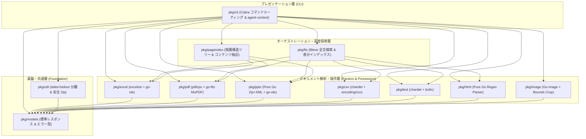

# `pkg/` - Core Internal Packages Architecture

## 1. 責務 (Responsibility)
`pkg/` は `doctools-cli` のすべてのコアビジネスロジック、フォーマット別パーサー、全文検索エンジン、および CLI コマンドハンドラをカプセル化する内部パッケージ群です。

---

## 2. レイヤー構造とパッケージ相関図

---

## 3. パッケージ一覧と役割

| パッケージ | ディレクトリ README | 主な責務・技術選定 |
|:---|:---|:---|
| **`pkg/cli`** | [`pkg/cli/README.md`](file:///C:/Users/satos/dev/doctools-cli/pkg/cli/README.md) | Cobra コマンドルーティング、引数検証、Layer 2 Introspection (`agent-context`) |
| **`pkg/fts`** | [`pkg/fts/README.md`](file:///C:/Users/satos/dev/doctools-cli/pkg/fts/README.md) | Pure Go `Bleve` 全文検索、On-the-fly チャンク化、隠しフォルダ高速枝刈り |
| **`pkg/pageindex`** | [`pkg/pageindex/README.md`](file:///C:/Users/satos/dev/doctools-cli/pkg/pageindex/README.md) | 階層構造 RAG、Progressive Disclosure（段階的深さ探索）、ピンポイント抽出 |
| **`pkg/excel`** | [`pkg/excel/README.md`](file:///C:/Users/satos/dev/doctools-cli/pkg/excel/README.md) | `excelize` による CSV/Markdown 抽出、セル差分 (Diff)、安全パッチ (Patch)、`go-ole` 画像化 |
| **`pkg/pdf`** | [`pkg/pdf/README.md`](file:///C:/Users/satos/dev/doctools-cli/pkg/pdf/README.md) | `pdfcpu` (テキスト・分割・結合) + `go-fitz` MuPDF CGO (高精細スライド画像化) |
| **`pkg/pptx`** | [`pkg/pptx/README.md`](file:///C:/Users/satos/dev/doctools-cli/pkg/pptx/README.md) | Pure Go Zip+XML テキスト抽出・結合 + `go-ole` スライド画像化 |
| **`pkg/csv`** | [`pkg/csv/README.md`](file:///C:/Users/satos/dev/doctools-cli/pkg/csv/README.md) | `chardet` 自動文字コード判別、1-based 部分読み込み、セル内検索 |
| **`pkg/text`** | [`pkg/text/README.md`](file:///C:/Users/satos/dev/doctools-cli/pkg/text/README.md) | 行ストリーム処理 (`head`/`tail`/`grep`)、文字コード変換 (CP932/UTF-8) |
| **`pkg/html`** | [`pkg/html/README.md`](file:///C:/Users/satos/dev/doctools-cli/pkg/html/README.md) | Pure Go による超高速テキスト・Markdown 抽出、不要タグ・スクリプト除去 |
| **`pkg/image`** | [`pkg/image/README.md`](file:///C:/Users/satos/dev/doctools-cli/pkg/image/README.md) | メタデータ取得、矩形クロップ (`Crop`)、クリップボード画像保存 |
| **`pkg/models`** | [`pkg/models/README.md`](file:///C:/Users/satos/dev/doctools-cli/pkg/models/README.md) | ゼロ依存の標準 JSON レスポンスエンベロープ (`Response`, `ErrorResponse`) |
| **`pkg/util`** | [`pkg/util/README.md`](file:///C:/Users/satos/dev/doctools-cli/pkg/util/README.md) | `stdout`/`stderr` 完全分離出力ヘルパー、Zip Slip 防御付きアーカイブ操作 |

---

## 4. 全体不変条件とアーキテクチャ原則 (Invariants & Rules)

1. **厳格な単方向依存**:
   - 下位層（`models`, `util`, 各パーサー）は上位層（`cli`, `fts`, `pageindex`）をインポートしてはならない。循環参照は厳禁。
2. **標準出力 (`stdout`) 汚染の完全禁止**:
   - `pkg/cli` 以外のパーサー・ロジックパッケージ内で `fmt.Println` や `os.Stdout` への直接書き込みを行ってはならない。データは戻り値で返し、ログや警告は `stderr` またはエラー構造体に載せること。
3. **Handle-Based パス渡し**:
   - 画像や大容量出力はメモリ内にバイナリを展開して返却せず、ファイルシステム上に出力してパス（ハンドル）を返却する。
4. **テストカバレッジ 90% 以上の死守**:
   - すべてのパッケージは単体・結合テストを備え、ステートメントカバレッジ 90% 以上を維持すること。

---

## 5. 関連仕様書 (Related Specs)
- プロダクト憲法: `doc/product.md`
- 技術スタック憲法: `doc/tech.md`
- ディレクトリ構造憲法: `doc/structure.md`
- 要求仕様書: `doc/requirements.md`
- 基本・詳細設計書: `doc/design.md`
