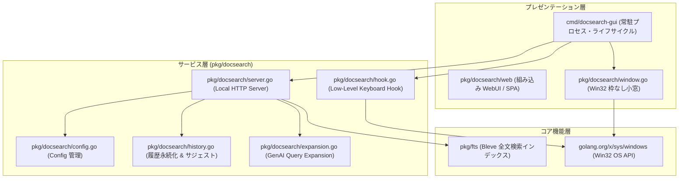

# `pkg/docsearch` - Desktop Search GUI Service Layer

## 1. 責務 (Responsibility)
`pkg/docsearch` は、人間向けデスクトップ検索 GUI (`cmd/docsearch-gui`) のサービス層およびバックエンドロジックを提供するパッケージです。
以下の責務を担います：
- **設定ファイル・検索履歴の管理と永続化**: `docsearch.json` によるサーバー/ホットキー/インデックス/LLM設定のロード、`history.json` による検索語・利用頻度・利用日時の永続化およびインクリメンタルサジェスト。
- **Win32 低レベルキーボードフック**: `golang.org/x/sys/windows` を利用したグローバルキー入力監視と Ctrl 連打（ダブルタップ）検知。
- **Win32 ネイティブ小窓 UI**: 純 Go と Win32 API (`CreateWindowEx`) による検索バー・インデックス選択小窓の描画とキー操作。
- **横断全文検索 & ローカル HTTP API**: Bleve Multi-Index (`IndexAlias`) による統合全文検索、ファイル/フォルダの直接起動、Google GenAI によるクエリ拡張 (Query Expansion)。

---

## 2. 選定理由 (Why) & 設計方針

### AI エージェント向け CLI と人間向け GUI の関心事分離
- `doctools-cli` は、AI エージェントがパイプラインや非対話環境から高速・決定論的に呼び出すための **Agent-Native CLI** です。対話プロンプトや GUI ウィンドウ、OS 常駐フックは一切持たず、プレーンな入出力（stdout JSON / stderr）に特化しています。
- 一方、`docsearch-gui` は、**人間のナレッジワーカー** が日常業務で素早くローカル文書を検索・閲覧するための常駐型デスクトップツールです。
- この 2 つのツールの関心事を明確に分離し、GUI 固有の依存（Win32 GUI/Hook、HTTP Web サーバー、検索履歴、LLM クエリ展開）を `pkg/docsearch` に集約することで、AI エージェント向けツールのバイナリサイズおよびコンテキストの汚染を防ぎます。

---

## 3. レイヤー構造と依存関係制約

### 依存関係制約 (Dependency Invariants)
1. **Bleve 検索エンジン依存**: 全文検索には `pkg/fts` の Bleve インデックス構造およびフォーマットを使用し、インデックス形式の二重管理を防止する。
2. **OS 固有 API**: Windows ネイティブ機能（低レベルキーフック、ウィンドウ制御）には `golang.org/x/sys/windows` を使用する。
3. **stdout 汚染の防止**: `pkg/docsearch` 内部では直接 `fmt.Println` や `os.Stdout` への書き込みを行わず、適切なロギングまたはエラー返却を行う。
